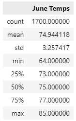
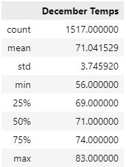

# surfs_up
An analysis of weather in Hawaii using Python, SQLite, and Flask

## Overview: 
Would a surf shop/ice cream parlor in Hawaii be a profitable business year round? That is the question this analysis will attempt to answer, specifically through using weather station data in Oahu to check average temperatures during different times of the year. Although Hawaiian weather is often considered extremely fair, winter month temperatures may dip below the point where people would be interested in ice cream. After looking at the data below, we'll consider other lines of inquiry to answer this question.

## Results: 

* Firstly, let's assess the weather in the summer. Using the data from the  weather station with the most readings on Oahu, let's zero in on June. Below we have a summary table of the temperatures: 
  
    

    As we we can see, the weather is indeed quite fair in the summer. With an average temperature of 75 degrees and a median of 75, we can tell that there are few outliers despite the lowest and highest temps being a spread 20 degrees between 64 and 85. We can definitely count on people not being turned away by the weather for surfing and ice cream

 

* Second, let's take a look at the winter temperatures. Using the same weather station, we will pull the temperatures for the month of December, exactly 6 months after the first set:

    

    Above it is clear that the temperatures are still extremely comfortable. Although the lowest temperature is a practically frigid 56 degrees, the average is 71, with a median of 71. Once again we can see that there are few outliers, and with a lower quartile of 69 we can practically be guaranteed a month of nice days.

 

* Looking at these two data summaries together, we can conclude that the temperatures in Hawaii are extremely stable, and barely change throughout the year. This is good news for establishments that require a certain environment to be successful, including of course surf shops and ice cream parlors.

## Summary: 

To reiterate, looking at the weather data we can see that temperature is not going to be an issue with this business idea. Anyone who has enjoyed ice cream outside I am sure would agree that 70-75 degrees is optimal ice cream eating conditions; not too cold to enjoy it and not too hot to melt it into a sticky mess. Surfing has more range of enjoyable temperatures, but most beach variety surfers are going to enjoy this temperature range very much, and may go so far as to say the conditions are optimal. Of course there are many other factors that can and would influence this sort of business's success such as location, tourism traffic by month, how many other similar shops are in the area, but lets ask two more questions about the weather.

1. **What are the precipitation readings for June and December?**
   While the temperature in June and December may be similar, we may find that the precipitation is very different. Many tropical climates that do not have four season cycles often have a rainy season and a dry season. Rain is most likely a factor which would deter people from surfing and possibly eating ice cream as well. 

2. **What is the historical weather data for June and December?**
   While the temperatures where very similar in the year this data was taken, this itself could be an outlier and it is more common to have a greater difference. Also, by looking at the historical data, we could possibly make claims not just about the weather on Oahu but the climate as well in order to make very well informed, long term decisions.